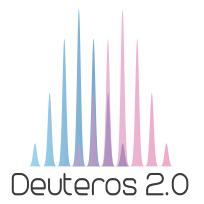

<!-- PROJECT LOGO -->
 

  

<h3 align="center">Deuteros 2.0</h3>

  

    Deuteros is an app designed for analysing and visualising data from hydrogen deuterium exchange mass spectrometry (HDX-MS) experiments, including quickly analysing peptide-level uptake kinetics, differential analysis, statistical testing via Woods and Volcano plots, back exchange correction and exporting to molecular graphics.
     
     
    <a href="https://github.com/andymlau/Deuteros_2.0/releases">Releases</a>
    ·
    <a href="https://github.com/andymlau/Deuteros_2.0/wiki"><strong>Wiki & Tutorials »</strong></a>
     
  

<!-- TABLE OF CONTENTS -->

  
Table of Contents

  <ol>
    <li>
      <a href="#about-the-project">About The Project</a>
      <ul>
        <li><a href="#built-with">Built With</a></li>
      </ul>
    </li>
    <li>
      <a href="#getting-started">Getting Started</a>
      <ul>
        <li><a href="#prerequisites">Prerequisites</a></li>
        <li><a href="#installation">Installation</a></li>
      </ul>
    </li>
    <li><a href="#usage">Usage</a></li>
    <li><a href="#license">License</a></li>
    <li><a href="#contact">Contact</a></li>
    <li><a href="#acknowledgments">Acknowledgments</a></li>
  </ol>

## About The Project

This repo is for the second iteration of Deuteros, Deuteros 2.0, which greatly improved on features set out in the first version. As Deuteros was developed during my PhD which ended in 2019, the app is no longer actively maintained and feature requests/bug fixes might take some time to be implemented. 

The original Deuteros can be found [here](), as well as its reference, [here](). 

## Reference

If Deuteros was helpful for your work, please cite the following paper:

- Lau, A. M., Claesen, J., Hansen, K., Politis, A. 2021. Deuteros 2.0: Peptide-level significance testing of data from hydrogen deuterium exchange mass spectrometry. Bioinformatics, btaa677, https://doi.org/10.1093/bioinformatics/btaa677.

## Getting Started

We provide installers for both MacOS and Windows systems, but as Deuteros was primarily designed and developled on the former, there may be small visual differences between Windows and Mac versions. We expect MacOS to provide the smoothest experience. 

Deuteros was designed using MATLAB's _appdesigner_ and compiled with MATLAB 2022b. To run Deuteros, you do not need to have an installation of MATLAB. Running the `_installer.app/exe` installer should automatically grab everything you need. 

The latest version of Deuteros can be found on the Releases sidebar link or [here](https://github.com/andymlau/Deuteros_2.0/releases/latest). 

### Installation

There are two types of applications/executables provided (`XXXX`: version, `OS`: mac/win):
1. `Deuteros_XXXX_OS.app.zip`
2. `Deuteros_XXXX_OS_installer.app.zip`

Unzip and run 1. if your system already has an up to date version of MATLAB (2022b) installed and use 2. otherwise, as the installer will automatically download and install the MATLAB Runtime needed to run Deuteros 2.0.

## Usage

#### Input data

The intended input to Deuteros 2.0 is the DynamX "cluster" `csv` file. The cluster file contains peptide deuterium uptake data at the replicate level for all proteins and states that were exported from a DynamX session. 

In v2.3.1, a file conversion tool was added to support re-formating HDExaminer files into the "cluster" format. A standalone tool is also available as a [Colab notebook](https://github.com/andymlau/File-conversion-for-HDX).

## FAQ
1. _Is Deuteros 2.0 free to use?_  
Both Deuteros and Deuteros 2.0 availabel under the Apache 2.0 license and are **completely free** to use and do not require MATLAB or a MATLAB license to run. Only the MATLAB Runtime library is necessary and this is automatically installed with the software.

2. _I don't have MATLAB, can I still use Deuteros 2.0?_  
Yes, Deuteros 2.0 **does not need MATLAB**, but only the MATLAB Runtime library which is automatically installed as long as you have an internet connection.

3. _Can Deuteros 2.0 be installed on a machine that does not have an internet connection?_  
Yes, the only difference is that you can download the MATLAB Runtime library (R2019b v9.7) manually and install this first before installing Deuteros 2.0. The Deuteros 2.0 installer should automaticaly identify the library on your system and skip the download.
The library can be downloaded from the MathWorks website at: https://uk.mathworks.com/products/compiler/matlab-runtime.html

4. _The GUI of Deuteros 2.0 is blank when I open it (on both MacOS and Windows)_  
We have noticed that this can occur when Deuteros 2.0 is installed and opened for the first time. Closing and opening it again seems to fixes this issue. 

5. _When I open Deuteros 2.0, I can't see the whole GUI._  
You may need to adjust the resolution of your display in order for Deuteros 2.0 to be displayed in its entirety. The GUI has a resolution of 1222x953. On Windows systems, you may need to play around with the scaling of the display in order to show the Deuteros GUI properly. You can change the display scale in Windows via: Settings > Display > Scale and Layout > Change the size of text, apps, and other items > set to e.g. 100%. 

6. _Is ion mobility functionality supported? (or only the retention time and m/z dimensions)?_  
As the DynamX cluster output does not include ion mobility metrics regardless of whether mobility is used or not during acquisition, Deuteros 2.0 does not make use of this data type. This is also to say that Deuteros 2.0 does not differentiate between data collected with or without ion mobility - both are processed identically.

## License

Distributed under the MIT License. See `LICENSE.txt` for more information.

## Contact

Your Name - [@twitter_handle](https://twitter.com/twitter_handle) - email@email_client.com

Project Link: [https://github.com/github_username/repo_name](https://github.com/github_username/repo_name)

## Acknowledgments